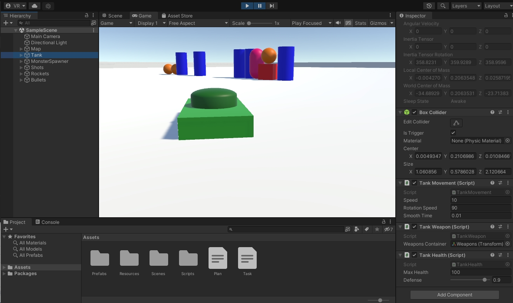

# Тестовое задание Unity "Tank Deathmatch"
Задание состоит из нескольких пунктов, выполните максимально возможное количество:
1) На сцене располагается танк (с здоровьем, защитой и скоростью передвижения)
2) Танк должен уметь двигаться по сцене, поворачиваться (стрелками на клавиатуре) и уметь стрелять (лкм)
3) Оружие у танка должно быть нескольких видов (с разным внешним видом и уроном)
4) У танка должна быть возможность смены оружия (кнопки Q и E)
5) Монстры должны быть нескольких видов (с разным внешним видом, количеством здоровья, урона, защиты и скоростью передвижения)
6) Монстры должны рождаться рандомно за экраном и направляться к танку
7) На сцене единовременно должно располагаться не более 10 монстров, при смерти одного должен рождаться следующий.
8) При попадании пули в монстра его здоровье должно уменьшаться соответственно урону от пули и защите монстра
9) При коллизии с танком, здоровье танка должно уменьшаться соответственно защите танка и урону от монстра.

## Установка:

1. Склонируйте репозиторий проекта на свое устройство.
2. Откройте проект в Unity (2021.3.16f1).
3. Соберите и запустите проект на вашем устройстве.

## Использование:

- Используйте клавиши WASD или стрелки для перемещения танка.
- Нажмите клавиши Q и W для переключения между различными видами оружия.
- Нажмите ЛКМ для выстрела снарядами.
- Выживайте как можно дольше, побеждая монстров.

## API:

## TankMovement:

Класс `TankMovement` отвечает за управление танком. Он содержит логику перемещения танка.

### Поля

- `speed`: Скорость перемещения танка.
- `rotationSpeed`: Скорость поворота танка.
- `smoothTime`: Время затухания скорости движения.

## TankHealth:

Класс `TankHealth` отвечает за управление здоровьем танка и обработку событий связанных со здоровьем.

### Поля

- `maxHealth`: Максимальное значение здоровья танка.
- `currentHealth`: Текущее значение здоровья танка.

### События

- `OnDeath`:  Публичное событие, происходящее при смерти танка.

### Методы

- `TakeDamage(float damage)`: Вызывается при получении урона танком. Уменьшает значение здоровья танка на указанную величину. Если здоровье становится меньше или равным нулю, вызывает метод `Die()`.
- `Die()`: Вызывается при смерти танка. Инициирует необходимые действия при смерти.
## TankWeapon:

Класс `TankWeapon` представляет оружие танка, которое позволяет выпускать пули.

### Поля

- `weaponsContainer`: Контейнер, который содержит все виды доступного оружия.

## BulletPool:

Класс `BulletPool` представляет пул снарядов, который управляет созданием и переиспользованием снарядов в игре.

### Поля

- `bulletPrefab`: Префаб снаряда.
- `poolSize`: Размер пула, то есть максимальное количество пуль, которые могут быть активными одновременно.

### Методы

- `GetBullet()`: Дает доступ к неактивной пуле. Если нет доступных пуль, создает новую.

## Интерфейс IWeapon:

Интерфейс `IWeapon` определяет общие методы для оружия в игре.

### Методы

- `SetActive(bool isActive)`: Определяет активность оружия.
- `Shoot()`: Выпускает снаряд из оружия.
##  BulletMovement:

Класс `BulletMovement` отвечает за движение снарядов в игре.

### Поля

- `spreadAngle`: Разброс снарядов от заданного направления.
- `speed`: Скорость движения снаряда.

### Методы

- `SetDirection(Vector3 direction)`: Задает направление движения пули.

## BulletDamage:

Класс `BulletDamage` представляет урон, наносимый пулей в игре.

### Поля

- `damage`: Урон, наносимый пулей.

## MonsterSpawner:

Класс `MonsterSpawner` отвечает за спавн и управление количеством монстров в игре.

### Поля

- `monsterPrefabs`: Список префабов монстров, из которых будет осуществляться спавн.
- `target`: Целевой объект, за которым монстры будут следовать.
- `maxMonsters`: Максимальное количество монстров, которые могут находиться на сцене одновременно.

## MonsterMovement:

Класс `MonsterMovement` отвечает за движение монстра к целевому объекту.

### Поля и свойства

- `Target`: Целевой объект, к которому монстр движется.
- `movementSpeed`: Скорость передвижения монстра.
## MonsterHealth:

Класс `MonsterHealth` отвечает за управление здоровьем монстра.

### Поля

- `defense`: Защита монстра.
- `maxHealth`: Максимальное количество здоровья монстра.

### События

- `OnDeath`: Событие, вызываемое при смерти монстра.

### Методы

- `TakeDamage`: Наносит урон монстру и обновляет количество здоровья.

## MonsterDamage:

Класс `MonsterDamage` определяет урон, который может нанести монстр.

### Поля

- `damage`: Величина урона, наносимого монстром.

## CameraFollow:

Класс `CameraFollow` обеспечивает плавное следование камеры за целевым объектом.

### Свойства

- `target`: Целевой объект, за которым будет следовать камера.
- `followSpeed`: Скорость следования камеры.
- `rotationSpeed`: Скорость поворота камеры.

___
## Контакты:
[LinkedIn: **ryabchenko**](https://www.linkedin.com/in/ryabchenko)  
[Telegram: **whyv2**](https://t.me/whyv2)    
[Email: **00bl@bk.ru**](mailto:00bl@bk.ru)
